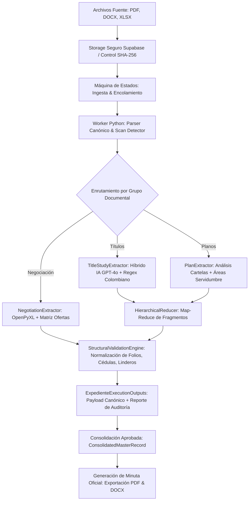
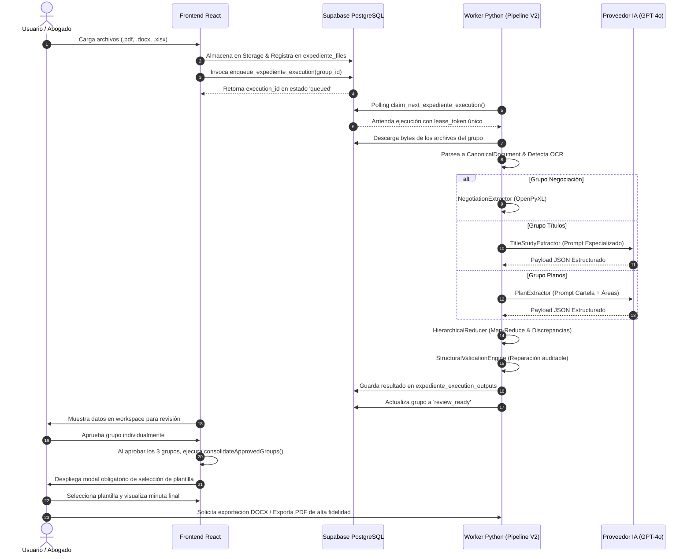
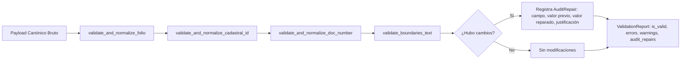

# INFORME TÉCNICO Y OPERATIVO EXHAUSTIVO
## Procesamiento y Extracción de Información en el Módulo de Expedientes
### Territorium Legalítica · Sistema Experto de Gestión y Consolidación Jurídica Inmobiliaria

---

## 1. INTRODUCCIÓN Y ALCANCE DEL MÓDULO

El **Módulo de Expedientes** de Territorium es el núcleo de ingeniería documental y analítica predial diseñado para transformar colecciones heterogéneas, desestructuradas y masivas de documentos jurídicos, técnicos y económicos en un **Consolidado Maestro Predial Inmutable**, validado estructuralmente y apto para la generación automatizada de minutas y contratos notariales.

En proyectos de infraestructura, energía, saneamiento predial e hidrocarburos en Colombia, la conformación de un expediente inmobiliario enfrenta retos severos:
* Documentos en formatos múltiples (PDF escaneados, PDF vectoriales, actas notariales en formato Word `.docx`, y matrices financieras en hojas de cálculo `.xlsx`).
* Discrepancias intrínsecas entre escrituras públicas antiguas, certificados de tradición y libertad (CTL), levantamientos topográficos y ofertas comerciales de negociación.
* Errores humanos de digitación en cédulas catastrales, números de documento de propietarios y transcripción deficiente de linderos.

El presente informe detalla exhaustivamente cada etapa del pipeline, desde la recepción física del archivo hasta la consolidación final y la exportación de documentos oficiales.



---

## 2. ARQUITECTURA DE TRES CAPAS Y ROLES DE COMPONENTES

El sistema opera bajo un desacoplamiento estricto entre tres entornos de ejecución:

| Capa | Tecnologías | Rol y Responsabilidad Primaria |
| :--- | :--- | :--- |
| **Frontend (Cliente)** | React 18, Vite, TypeScript, Lucide Icons, html2pdf.js | Interfaz de usuario reactiva, workspace de expediente, revisión visual de discrepancias, aprobación por grupos, selección de plantilla y renderizado interactivo con zoom/scroll. |
| **Persistencia & Transacciones** | Supabase (PostgreSQL 15), Row Level Security (RLS), PL/pgSQL RPCs, Storage | Gestión de estados transaccionales (`draft`, `ready`, `review_ready`, `approved`, `stale`, `error`), tokens de arrendamiento (`lease_token`), logs inmutables de IA y almacenamiento de blobs. |
| **Motor de Procesamiento (Worker)** | Python 3.11, FastAPI, Uvicorn, OpenAI API (GPT-4o), OpenPyXL, PyPDF, python-docx | Extracción canónica, segmentación semántica, Map-Reduce de fragmentos, validación de reglas de negocio inmobiliario colombiano y generación de matrices de discrepancias. |

---

## 3. EL MODELO CANÓNICO DE DOCUMENTOS (`CanonicalDocument`)

A diferencia de sistemas convencionales que pasan texto plano sin estructurar a los modelos de lenguaje, Territorium convierte cada documento cargado en una representación orientada a objetos denominada `CanonicalDocument`.

### 3.1 Unidades Estructurales (`UnitType`)
Cada archivo es desglosado jerárquicamente en:
* `paragraph`: Párrafo narrativo con delimitación de saltos de línea.
* `table_cell` y `table_row`: Datos tabulares preservando relación fila-columna.
* `table`: Bloques de tablas (frecuentes en cuadros de áreas y anotaciones de folios).
* `page`: Delimitación física de página para PDFs.
* `excel_cell`: Coordenada precisa (`A1`, `C14`) para hojas de cálculo.

### 3.2 Clasificación de Escaneo y Calidad (`ScanClassification`)
Antes de intentar la extracción, el módulo `scan_detector.py` analiza cada página mediante métricas de densidad textual:
1. **`TEXTUAL`**: La página contiene texto digital incrustado (capa vectorial legible). El ratio de caracteres por unidad de área es óptimo.
2. **`SCANNED`**: La página es una imagen rasterizada pura (sin capa de texto). Requiere OCR antes del análisis textual.
3. **`MIXED`**: Contiene sellos o firmas superpuestas pero conserva fragmentos textuales analizables.
4. **`PROTECTED`**: Archivo con restricciones criptográficas de lectura o permisos bloqueados por la notaría.
5. **`CORRUPT`**: Bytes no conformes con el estándar PDF/DOCX.

### 3.3 Trazabilidad Inmutable: `DocumentFragment` y `FragmentLocator`
Cada fragmento extraído contiene:
* `fragment_id`: Identificador único determinista (UUID v5 / hash).
* `locator`: Objeto que guarda `document_id`, `original_name`, `page_number`, `unit_type`, `unit_index` y `location_label` (ej: *"Página 3, Párrafo 4"* o *"Hoja 1, Celda F12"*).
* `confidence`: Puntuación de confianza (0.0 a 1.0).

---

## 4. CICLO DE VIDA COMPLETO: PASO A PASO ORDENADO

Para garantizar el resultado con total certidumbre jurídica, el procesamiento sigue una secuencia ordenada de siete (7) fases:



### Paso 1: Ingesta, Hashing y Control de Versiones
1. El usuario sube los archivos en el panel correspondiente a su grupo:
   * **Títulos**: Escrituras públicas, Certificados de Tradición y Libertad (CTL), resoluciones del INCODER/ANT.
   * **Planos**: Levantamientos topográficos, planos de servidumbre en PDF.
   * **Negociación**: Ficha de negociación predial en formato Excel `.xlsx`.
2. El sistema calcula en cliente el hash SHA-256 de los bytes del archivo para evitar reprocesamientos redundantes y garantizar la cadena de custodia probatoria.
3. Se registran en la tabla `expediente_files`. Si el grupo estaba previamente en estado `approved` o `review_ready`, la adición o retiro de un archivo incrementa el `input_version` y transiciona el grupo a `ready`, invalidando ejecuciones obsoletas mediante `superseded`.

### Paso 2: Encolamiento Transaccional y Concurrencia Idempotente
1. El frontend ejecuta el procedimiento almacenado transaccional `enqueue_expediente_execution(p_group_id, p_project_id, p_triggered_by)`.
2. La función de PostgreSQL:
   * Cancela cualquier ejecución en progreso anterior marcándola como `superseded`.
   * Inserta un nuevo registro en `expediente_executions` con estado `queued` y prioridad configurable.
   * Actualiza el estado del grupo a `queued`.
3. El Worker Python ejecuta una rutina en segundo plano mediante `claim_next_expediente_execution()`. Esta función utiliza `FOR UPDATE SKIP LOCKED` a nivel de base de datos, garantizando que múltiples workers nunca tomen el mismo trabajo ni generen condiciones de carrera (*race conditions*). Se genera un `lease_token` criptográfico con vencimiento de 10 minutos.

### Paso 3: Ejecución Especializada por Grupo Documental

#### A. Grupo de Negociación (`negotiation_extractor.py` & `negotiation_reader.py`)
* **Extracción 100% Determinista**: No depende de inferencia probabilística. Utiliza la librería `openpyxl` para recorrer el libro contable de negociación.
* **Búsqueda Inteligente de Coordenadas**:
  * Localiza la celda del código del predio objetivo (`target_property_code`).
  * Extrae los valores de la 1ª Oferta, 2ª Oferta y Oferta Definitiva.
  * Valida coherencia financiera: si el valor de la oferta no coincide con el avalúo catastral o comercial registrado, registra una discrepancia aritmética.
* **Conversión Numérica a Letras**: Aplica el algoritmo de transcripción monetaria oficial colombiana (ej. `$ 15.000.000` -> *"QUINCE MILLONES DE PESOS MONEDA CORRIENTE"*).

#### B. Grupo de Estudio de Títulos (`title_extractor.py`)
* **Segmentación Semántica**: Si el documento contiene más de 8.000 tokens (típico en escrituras públicas de 40 páginas), el módulo `segmentation.py` divide el texto en secciones lógicas (Identificación del Inmueble, Antecedentes, Cláusulas, Gravámenes, Otorgantes).
* **Extracción Asistida por IA (OpenAI GPT-4o)**:
  * Se invoca el modelo con `temperature=0.0` y `response_format={"type": "json_object"}`.
  * Se inyecta el `TITLE_STUDY_SYSTEM_PROMPT`, el cual contiene 13 reglas jurídicas colombianas obligatorias:
    1. *Folio de Matrícula*: Formato con código ORIP (ej: `324-72404`, `050N-204581`).
    2. *Cédula Catastral*: 15 a 30 dígitos numéricos.
    3. *Propietarios Vigentes*: Solo titulares actuales de dominio pleno o nuda propiedad.
    4. *Linderos Exactos*: Transcripción literal sin resúmenes desde el punto de partida hasta el cierre.
    5. *Modo de Adquisición*: Acto jurídico, tradente, instrumento público y número de anotación en el folio.
    6. *Condiciones Jurídicas*: Gravámenes, afectaciones a vivienda familiar, embargos o la leyenda obligatoria *"sin condiciones jurídicas vigentes"*.
    7. *Radicados Especiales*: Casos de restitución de tierras (URT) y consultas ante el Ministerio de Justicia.
* **Mecanismo de Resiliencia (Fallback Heurístico Regex)**: Si la API de IA presenta timeout, indisponibilidad o falla de cuota, el extractor activa automáticamente el motor `_heuristic_extract()`. Este motor cuenta con patrones de expresiones regulares pre-entrenados sobre el lenguaje notarial colombiano para extraer matrículas, propietarios y linderos sin detener la operación.

#### C. Grupo de Planos Topográficos (`plan_extractor.py`)
* **Análisis de Cartela Técnica**:
  * Extrae el código oficial del plano, escala (ej: `1:1000`), fecha de elaboración y profesional responsable.
  * Identifica el nivel de tensión de la línea de transmisión (ej: `115 kV`, `230 kV`, `500 kV`).
* **Geometría de la Servidumbre**:
  * Área de afectación total y franja de servidumbre (números y letras en metros cuadrados o hectáreas).
  * Longitud del eje en metros lineales.
  * Ancho de la franja de seguridad (ej: `30 metros`, `15 metros a cada lado del eje`).
  * Conteo de infraestructura física (número de torres, postes o apoyos proyectados dentro del predio).

---

## 5. REDUCCIÓN JERÁRQUICA Y DETECCIÓN DE CONFLICTOS (`HierarchicalReducer`)

Cuando un expediente contiene múltiples escrituras, certificados o planos, el `HierarchicalReducer` ejecuta un proceso de agregación estructurada:

```
[Fragmento Doc 1 (Escritura 2013)] ──┐
[Fragmento Doc 2 (CTL 2024)]       ──┼──> [HierarchicalReducer] ──> [Registro Canónico Unificado]
[Fragmento Doc 3 (Resolución ANT)] ──┘             │
                                                   └──> [Matriz de Discrepancias Cruzadas]
```

### 5.1 Reglas de Fusión y Prevalencia
1. **Colección de Propietarios**: Se de-duplican por número de documento de identidad (`document_number`). Si un propietario aparece en la escritura antigua pero en el CTL vigente fue transferido, prevalece la titularidad vigente.
2. **Linderos Literales**: El reductor selecciona la transcripción de mayor longitud y detalle descriptivo (`longest_boundaries`), preservando el estándar notarial de cierre perimetral.
3. **Modos de Adquisición**: Se concatenan cronológicamente con separadores dobles (` // `), estructurando la cadena de tradición del predio.

### 5.2 Detección de Discrepancias Cruzadas (`FieldDiscrepancy`)
Si el Documento A indica que el predio se llama *"La Esperanza"* y el Documento B indica *"El Recreo"*, o si las áreas presentan diferencias mayores a 0.01 m², el reductor no sobrescribe el dato silenciosamente:
* Genera una entrada en `discrepancies` con:
  * `field_name`: Campo en conflicto.
  * `values`: Lista de valores divergentes encontrados.
  * `sources`: Nombres de los archivos donde se encontró cada valor.
  * `description`: Explicación legible para el abogado revisor.

---

## 6. MOTOR DE VALIDACIÓN ESTRUCTURAL Y REPARACIÓN AUDITABLE (`StructuralValidationEngine`)

Antes de entregar el resultado al usuario, el motor `validator.py` somete la información a un control de calidad normativo mediante funciones puras:



### 6.1 Catálogo de Reglas Inmobiliarias Implementadas

| Regla | Función | Comportamiento y Validación | Acción en Caso de Inconsistencia |
| :--- | :--- | :--- | :--- |
| **Folio de Matrícula** | `validate_and_normalize_folio` | Verifica patrón `^\d{3}[A-Za-z]?-\d{5,8}$`. Elimina espacios, guiones dobles o letras espurias. | Si tiene formato recuperable, lo formatea y genera `AuditRepair`. Si es inválido, emite `ValidationIssue` de severidad `error`. |
| **Cédula Catastral** | `validate_and_normalize_cadastral_id` | Comprueba longitud de 15, 20 o 30 dígitos numéricos según la resolución IGAC. | Remueve caracteres no numéricos. Si no cumple la longitud legal, marca advertencia técnica. |
| **Documentos de Identidad** | `validate_and_normalize_doc_number` | Limpia puntos, comas y espacios en Cédulas de Ciudadanía y NITs. Calcula y valida dígito de verificación en NIT. | Normaliza a sólo dígitos numéricos. Deja registro auditable del cambio. |
| **Cierre de Linderos** | `validate_boundaries_text` | Busca puntos cardinales (`NORTE`, `SUR`, `ORIENTE`/`ESTE`, `OCCIDENTE`/`OESTE`) y expresiones de cierre (*"punto de partida"*, *"encierra"*). | Si faltan puntos cardinales, emite `warning` indicando que los linderos pueden estar incompletos. |
| **Titularidad Actual** | `validate_titles` | Valida que la lista de propietarios contenga al menos un titular con nombre y cédula. | Si la lista está vacía, bloquea la aprobación con `severity="error"`. |

---

## 7. APROBACIÓN TRANSVERSAL Y CONSOLIDACIÓN MAESTRA (`expedienteConsolidation.ts`)

Para salvaguardar la seguridad jurídica de la compañía, **ningún documento final puede generarse a partir de datos no verificados**.

### 7.1 El Requisito de la Triple Aprobación
El expediente requiere que un abogado especialista revise y apruebe individualmente cada uno de los tres componentes:
1. **Aprobación de Títulos**: Revisa folio, titulares, linderos y gravámenes.
2. **Aprobación de Planos**: Revisa franja de servidumbre, áreas y apoyos.
3. **Aprobación de Negociación**: Revisa ofertas y valores acordados.

### 7.2 Fusión en el `ConsolidatedMasterRecord`
Una vez aprobados los tres grupos, la función `consolidateApprovedGroups()` fusiona los payloads en un único objeto inmutable:
* Registra los IDs de versión exactos aprobados: `titles_result_version_id`, `plans_result_version_id` y `negotiation_result_version_id`.
* Guarda la estampa de tiempo `consolidated_at` y el usuario responsable `consolidated_by`.
* El consolidado queda sellado. Si en el futuro un archivo es modificado en cualquiera de los grupos, el estado del grupo pasa a `stale` o `ready`, pero el consolidado histórico mantiene su trazabilidad completa.

---

## 8. GENERACIÓN DOCUMENTAL Y EXPORTACIÓN DE ALTA FIDELIDAD

Una vez aprobado el consolidado maestro, el flujo no salta de forma descontrolada a generar un documento aleatorio. El sistema implementa una compuerta obligatoria:

```
[Consolidado Aprobado] ──> [Modal Obligatorio de Selección de Plantilla] ──> [Compilación de Minuta]
                                         │
        ┌────────────────────────────────┼────────────────────────────────┐
        ▼                                ▼                                ▼
[Minuta Servidumbre Eléctrica]  [Promesa de Compraventa]        [Poder Especial Notarial]
```

### 8.1 Selección Obligatoria de Plantilla
El usuario debe escoger explícitamente entre el catálogo de plantillas jurídicas oficiales:
* **Minuta de Constitución de Servidumbre de Energía Eléctrica**.
* **Promesa de Compraventa de Inmueble Rural**.
* **Poder Especial Amplio y Suficiente**.
* **Acta de Concertación y Permiso de Intervención**.

### 8.2 Visualizador Interactivo de Documento
El documento se renderiza en pantalla con características ergonómicas avanzadas:
* **Scroll Vertical Interno**: La tarjeta del documento mantiene altura contenida con desplazamiento interno, evitando scroll de la ventana principal.
* **Zoom Dinámico**: Controles de acercamiento/alejamiento (`Zoom In`, `Zoom Out`, `Reset`) y soporte nativo de gestos táctiles (pinch-to-zoom) mediante touchpad.

### 8.3 Motores de Exportación de Alta Fidelidad
1. **Exportación Oficial a Microsoft Word (`.docx`)**:
   * Endpoint de FastAPI `/api/documents/export-docx` implementado con `python-docx`.
   * Formato institucional con márgenes legales (3 cm superior e izquierdo, 2 cm inferior y derecho), tipografía formal (Arial / Times New Roman) y tablas estructuradas.
2. **Exportación a PDF de Alta Fidelidad (`html2pdf.js`)**:
   * Generación WYSIWYG directa a partir del contenido exacto del visualizador HTML.
   * Encabezado institucional de Territorium, numeración de páginas, código hash de verificación y firma de auditoría en el pie de página.

---

## 9. MATRIZ DE RIESGOS, MITIGACIONES Y DETERMINISMO

| Riesgo Técnico / Operativo | Impacto Potencial | Mitigación Implementada en el Sistema |
| :--- | :--- | :--- |
| **Alucinación de IA** | Inclusión de propietarios ficticios o linderos alterados. | Prompt con restricción estricta de subcadena exacta + Fallback heurístico determinista + Validación de citas obligatorias. |
| **Documentos Escaneados sin OCR** | Omisión de información crítica en escrituras antiguas. | Detección preventiva con `ScanClassification.SCANNED` y alerta temprana al usuario antes de procesar. |
| **Condiciones de Carrera (Workers concurrentes)** | Sobrescritura de ejecuciones o procesamiento duplicado. | RPC en PostgreSQL con `FOR UPDATE SKIP LOCKED` y arrendamiento con `lease_token`. |
| **Modificación de Archivos tras Aprobación** | Disparidad entre lo aprobado y los archivos en disco. | Procedimiento `expediente_retire_file` que invalida aprobaciones y transiciona el grupo a `ready`. |
| **Divergencia entre Plantilla y Documento Exportado** | El PDF descargado no refleja el texto editado en pantalla. | Integración directa de `html2pdf.js` capturando el DOM exacto del visualizador editable. |

---

## 10. CONCLUSIÓN

El Módulo de Expedientes de Territorium redefine el estándar de procesamiento jurídico-técnico inmobiliario en Colombia. Mediante la articulación armónica entre modelos canónicos estructurados, orquestación transaccional con PostgreSQL, extracción híbrida con salvaguardas heurísticas y consolidación transversal con triple firma, el sistema garantiza que cada dato consignado en una minuta final provenga de una fuente auténtica, verificable e inmutable.
